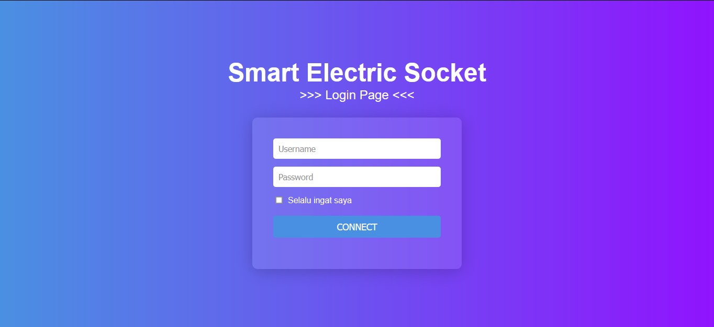
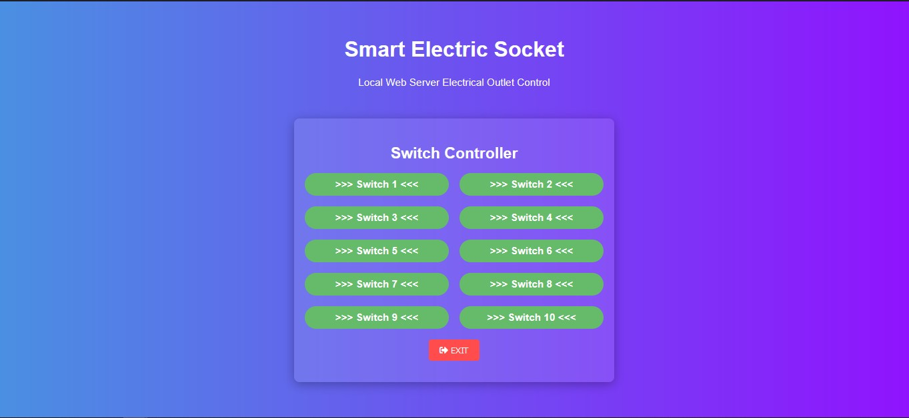

# Project IoT - Smart Electric Socket Base Web Server

## Overview

The **Smart Electric Socket** project is designed to control multiple electric switches via a web interface. Using the NodeMCU ESP8266 Lolin V3.0, this project enables you to manage electrical appliances remotely through a local network. The application is built with HTML, CSS, JavaScript, PHP, and MySQL.

## Features

- Control up to 10 switches.
- Real-time status updates for each switch.
- User authentication for secure access.
- Simple and responsive web interface.

## Project Structure

```markdown
/smart-electric-socket
│
├── index.html
├── css
│ ├── styles.css
│ ├── root.css
│
├── js
│ ├── script.js
│ ├── root.js
│
├── php
│ └── login.php
│
└── images
```

## Components Required

- NodeMCU ESP8266 Lolin V3.0
- Relay module (for controlling appliances)
- Jumper wires
- Breadboard (optional)
- Computer with XAMPP or similar server installed for PHP/MySQL

## Hardware Setup

1. Connect the relay module to the NodeMCU according to the following pin configuration:
   - D1 to Relay 1
   - D2 to Relay 2
   - D3 to Relay 3
   - D4 to Relay 4
   - D5 to Relay 5
   - D6 to Relay 6
   - D7 to Relay 7
   - D8 to Relay 8
   - D9 to Relay 9
   - D10 to Relay 10

## Software Setup

1. **Install the ESP8266 Board in Arduino IDE**

   - Open Arduino IDE.
   - Go to `File` > `Preferences` and add the following URL to the "Additional Board Manager URLs":
     ```
     http://arduino.esp8266.com/stable/package_esp8266com_index.json
     ```
   - Open the `Boards Manager` from `Tools` and search for `esp8266`, then install it.

2. **Upload the Code**

   - Use the following code in your Arduino IDE to upload to your NodeMCU:

   ```cpp
   #include <ESP8266WiFi.h>
   #include <WiFiClient.h>
   #include <ESP8266WebServer.h>

   #define NUM_SWITCHES 10
   int saklarPin[NUM_SWITCHES] = {D1, D2, D3, D4, D5, D6, D7, D8, D9, D10};

   // Replace with your network credentials
   const char* ssid = "MAI";
   const char* password = "Adm1n12345";

   ESP8266WebServer server(80);

   // Function to send switch status to the server
   void sendSwitchStatus(int switchNumber, const char* status) {
       WiFiClient client;
       String url = String("http://localhost/update_switch.php?switch=") + switchNumber + "&status=" + status;

       if (client.connect("192.168.11.200", 80)) { // Use the local IP of your XAMPP server
           client.print(String("GET ") + url + " HTTP/1.1\r\n" + "Host: " + "192.168.1.100" + "\r\n" + "Connection: close\r\n\r\n");
           delay(500); // Wait for response
       } else {
           Serial.println("Connection failed");
       }
   }

   // Add the rest of the code as provided...
   ```

## Set Up XAMPP

1. Install XAMPP and start the Apache and MySQL modules.
2. Create a database and table for storing switch states.
3. Add the necessary PHP scripts to handle requests from the NodeMCU.

<hr/>

## Web Interface

1. HTML/CSS/JavaScript
   - Create a simple login page and dashboard using HTML/CSS/JavaScript.
   - Use AJAX to send requests to the server to control the switches and retrieve their statuses.

## Interface index.html



## Interface Dashboard (root.html)



## Usage

- Connect your NodeMCU to the Wi-Fi network using the provided credentials.
- Access the web interface from any device connected to the same network.
- Use the interface to control the switches and monitor their statuses.

## License

This project is licensed under the MIT License. See the LICENSE file for details.
Acknowledgments

- NodeMCU team for the ESP8266 support.
- XAMPP for providing a local server environment.
- Arduino community for the rich ecosystem of libraries and support.
